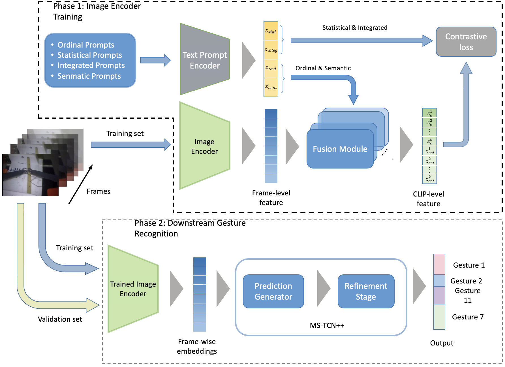

#  Zero-shot Prompt-based Video Encoder foor Surgical Gesture Recognition


<p align="center"></p>

## To Do List:
- :black_square_button: Towards-Unified-Surgical-Skill-Assessment
- :black_square_button: [Put it on axiv] ()
- :white_check_mark: submitted to IPCAI
- :white_check_mark: Inflated-3D
- :white_check_mark: MS-TCN2
- :white_check_mark: Bridge-Prompt
- :white_check_mark: Gesture Recognition in Robotic Surgery With Multimodal Attention

## Examples and experiments run on a Linux server with the following specifications:
* Ubuntu 22.04.3 LTS with 8 NVIDIA A40 GPUS
* Ubuntu 22.04.3 LTS with 4 NVIDIA A5000 GPUs

## Dataset preparation
Download JIGSAWS dataset from [here](https://cirl.lcsr.jhu.edu/research/hmm/datasets/jigsaws_release/)

## Installation
```bash
conda env create -f environment.yml
```

## Run Example for Bridge-Prompt on JIGSAWS
```bash
title=All_gestures
valid="B"
task="Suturing"
# Standard training
python ./Bridge-Prompt/preprocess/preprocess.py --vpath JIGSAWS_path --out /path/to/$title/$task-$valid --user_for_val $valid --task $task

# Limited gesture training
python ./Bridge-Prompt/preprocess/preprocess.py --vpath JIGSAWS_path --out /path/to/$title/$task-$valid --user_for_val $valid --task $task --filter_labels True --keep_labels 10
```

```bash
bash scripts/run_train.sh ./configs/JIGSAWS/JIGSAWS_ft.yaml $task $valid /path/to/$title/$task-$valid 
python extract_frame_features.py --config ./configs/JIGSAWS/JIGSAWS_exfm.yaml --pretrain ./exp/clip_ucf/ViT-B/16/JIGSAWS/$task-$valid/last_model.pt --savedir /path/to/$title/$task-$valid/visual_features
```
### Training using Gesture 
```
Change class_dir in JIGSAWS class in ./Bridge-Prompt/datasets/datasets.py from bf_mapping.json to bf_index_mapping.json
```

## Run Example for MS-TCN++ on JIGSAWS
```bash
mkdir -p /path/to/$title/$task-$valid/JIGSAWS
python ./MS_TCN2/preprocess.py --subdataset $task \
                                --vpath JIGSAWS_path \
                                --output /data/mingxing/$title/$task-$valid/JIGSAWS \
                                --visual_feat /path/to/$title/$task-$valid/visual_features
cp ./mapping.txt /path/to/$title/$task-$valid/JIGSAWS/mapping.txt
bash train.sh JIGSAWS .$task.LOUO.$valid /path/to/$title/$task-$valid/
bash test_epoch.sh JIGSAWS .$task.LOUO.$valid 100 /path/to/$title/$task-$valid/
```

Please refer to ./Bridge-Prompt/run_batch_cross_valid.sh for batch running

All the experiments checkpoints are [here](...)
All the viusal features are [here](...)

## Reference Code

- https://github.com/ttlmh/Bridge-Prompt
- https://github.com/sj-li/MS-TCN2
- https://github.com/piergiaj/pytorch-i3d
- https://github.com/kenshohara/3D-ResNets-PyTorch


## License

MIT License.